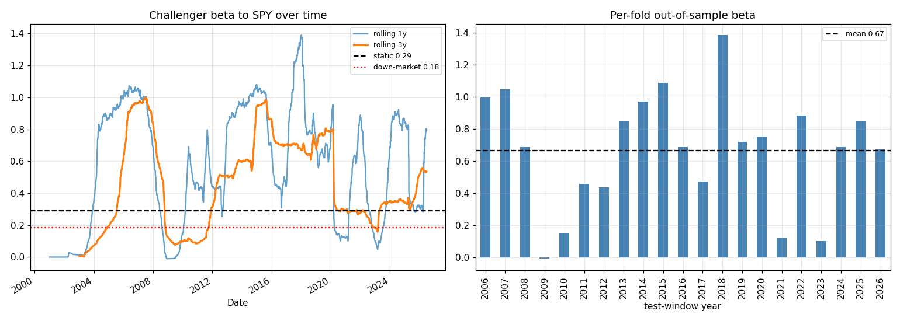

# Challenger beta stability

| Beta measure | Value |
|---|---|
| Static (all days) | 0.29 |
| Down-market days | 0.18 |
| Up-market days | 0.11 |
| Per-fold OOS mean | 0.67 |
| Per-fold OOS std | 0.36 |
| Per-fold OOS range | -0.01 to 1.39 |

The number that matters for a diversifier is **down-market beta** (0.18): if it were much higher than the static beta (0.29), the low-beta property would be illusory in exactly the crises where it's supposed to help. Per-fold dispersion (std 0.36) shows how stable the estimate is across the walk-forward's independent test windows.
