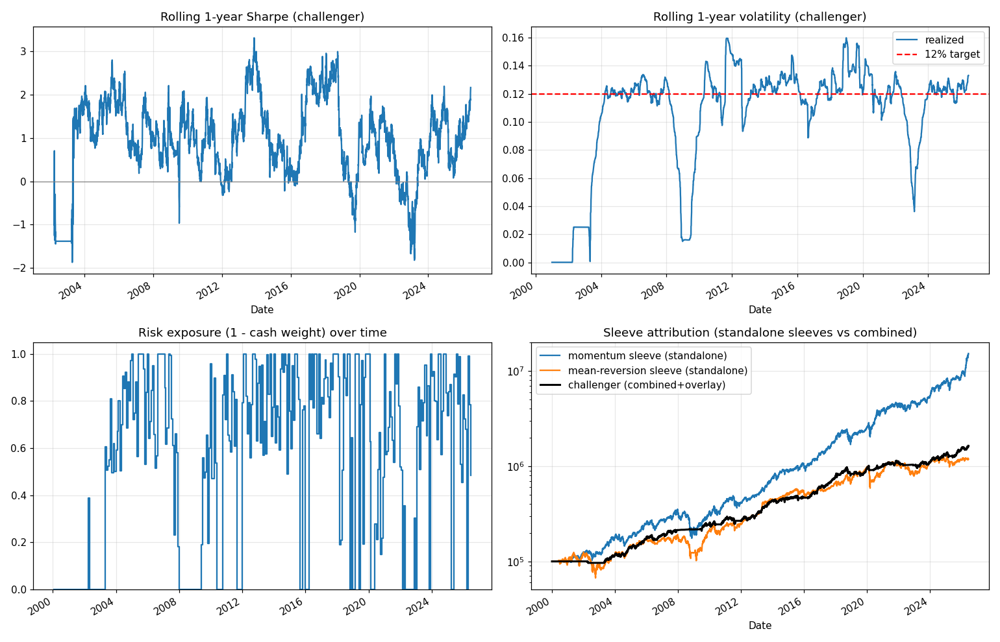

# Challenger diagnostics

Backtest 2000-01-03 to 2026-06-22, after 10 bps.

- Average risk exposure: 55% (rest in T-bills via vol targeting + regime)
- Standalone sleeve CAGRs and the combined curve are charted below.

Standalone sleeves carry NO regime/vol overlay — they show each signal's raw character. The combined challenger applies the regime model and 12% vol target on top, which is why it sits lower and smoother than the raw momentum sleeve.
