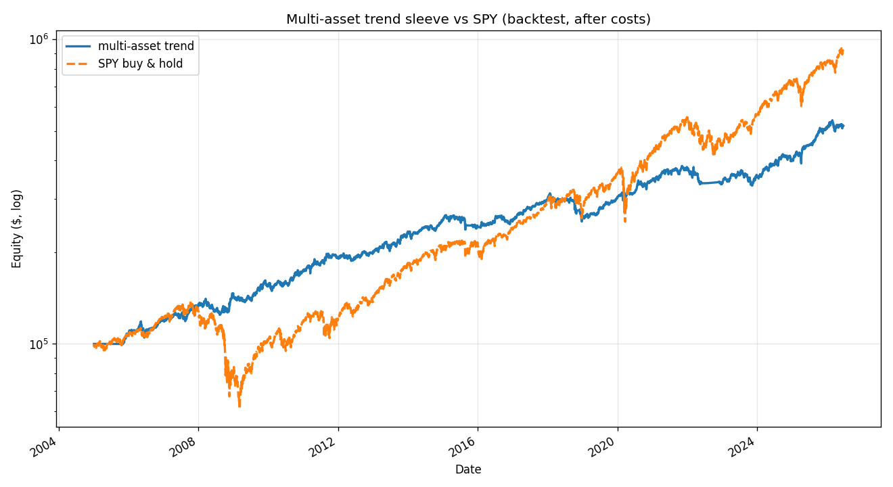

# Multi-asset trend sleeve — prototype

Assets: SPY, EFA, TLT, GLD + cash. Backtest from 2005-01-01, after 10 bps.

## Backtest (full history)
| Metric | Multi-asset | SPY |
|---|---|---|
| CAGR | 8.0% | 10.9% |
| Sharpe | 0.87 | — |
| Volatility | 9.4% | — |
| Max drawdown | -19.2% | — |
| Beta to SPY | 0.15 | — |
| Down-market beta | 0.06 | — |

## Out-of-sample walk-forward
CAGR 9.1%, Sharpe 0.97, vol 9.5%, maxDD -13.3%, excess vs SPY -5.7%.

## Crisis years (the point of the sleeve)
| Year | Multi-asset | SPY |
|---|---|---|
| 2008 | +8.7% | -36.8% |
| 2018 | -12.7% | -4.6% |
| 2020 | +14.7% | +18.3% |
| 2022 | -11.4% | -18.2% |

## Diversification vs the equity challenger
Return correlation: daily 0.57, monthly 0.48. Low correlation = combining the two would smooth the blended book.

