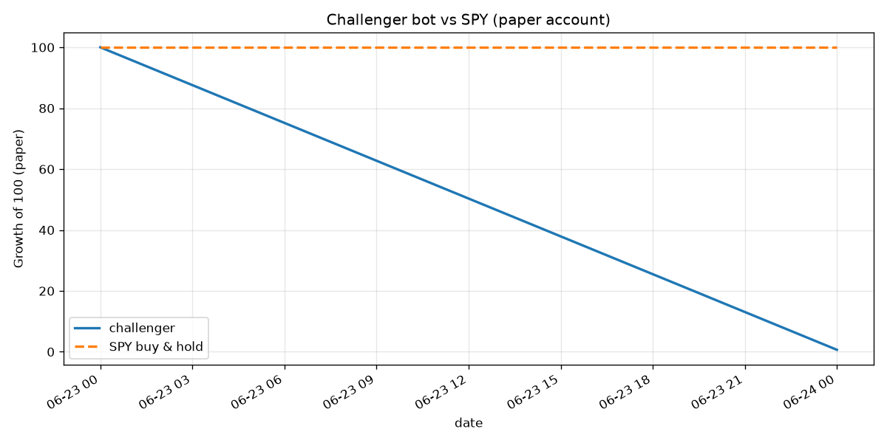

# Challenger bot vs SPY (paper account)

_Last updated: 2026-06-24 21:12 UTC · live for 1 days · equity $660_

| Metric | challenger | SPY |
|---|---|---|
| Total return | -99.34% | +0.00% |
| Excess vs SPY | -99.34% | — |
| Max drawdown | -99.34% | — |
| Sharpe | _needs 30+ days_ | — |

Reminder: these strategies trail the index for months at a time even when working. Judge on 3-6 months minimum, not weeks.
