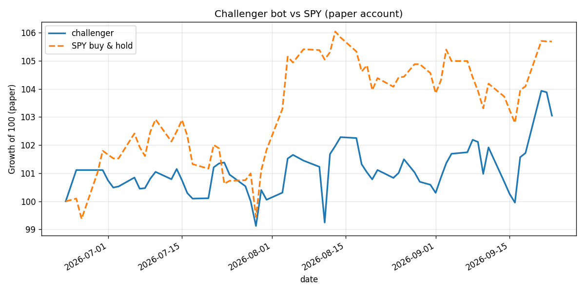

# Challenger bot vs SPY (paper account)

_Last updated: 2026-07-09 21:05 UTC · live for 16 days · equity $100,805_

| Metric | challenger | SPY |
|---|---|---|
| Total return | +0.81% | +1.61% |
| Excess vs SPY | -0.81% | — |
| Max drawdown | -0.66% | — |
| Sharpe | _needs 30+ days_ | — |

Reminder: these strategies trail the index for months at a time even when working. Judge on 3-6 months minimum, not weeks.
