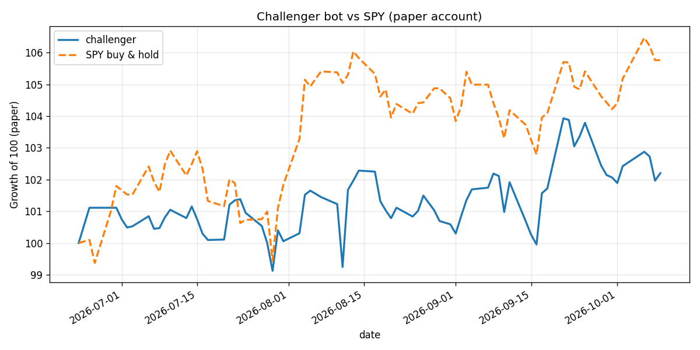

# Challenger bot vs SPY (paper account)

_Last updated: 2026-10-09 23:27 UTC · live for 108 days · equity $102,203_

| Metric | challenger | SPY |
|---|---|---|
| Total return | +2.20% | +5.76% |
| Excess vs SPY | -3.56% | — |
| Max drawdown | -2.37% | — |
| Sharpe (since inception) | 0.71 | — |

Reminder: these strategies trail the index for months at a time even when working. Judge on 3-6 months minimum, not weeks.
