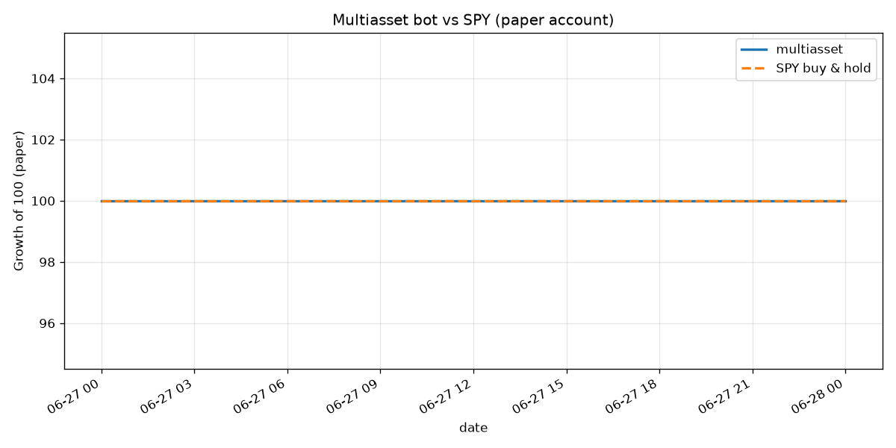

# Multiasset bot vs SPY (paper account)

_Last updated: 2026-06-28 03:42 UTC · live for 1 days · equity $100,000_

| Metric | multiasset | SPY |
|---|---|---|
| Total return | +0.00% | +0.00% |
| Excess vs SPY | +0.00% | — |
| Max drawdown | 0.00% | — |
| Sharpe | _needs 30+ days_ | — |

Reminder: these strategies trail the index for months at a time even when working. Judge on 3-6 months minimum, not weeks.
