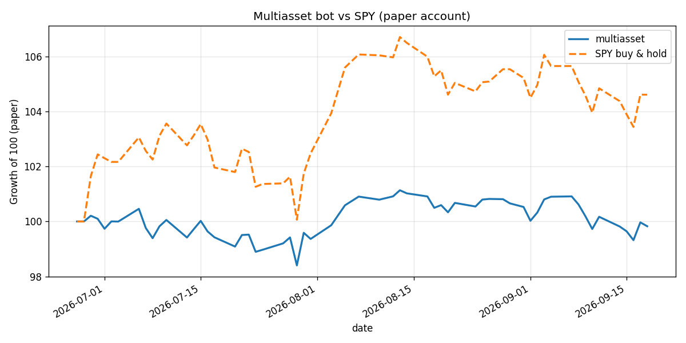

# Multiasset bot vs SPY (paper account)

_Last updated: 2026-08-24 19:58 UTC · live for 58 days · equity $100,544_

| Metric | multiasset | SPY |
|---|---|---|
| Total return | +0.54% | +5.04% |
| Excess vs SPY | -4.49% | — |
| Max drawdown | -2.05% | — |
| Sharpe (since inception) | 0.55 | — |

Reminder: these strategies trail the index for months at a time even when working. Judge on 3-6 months minimum, not weeks.
