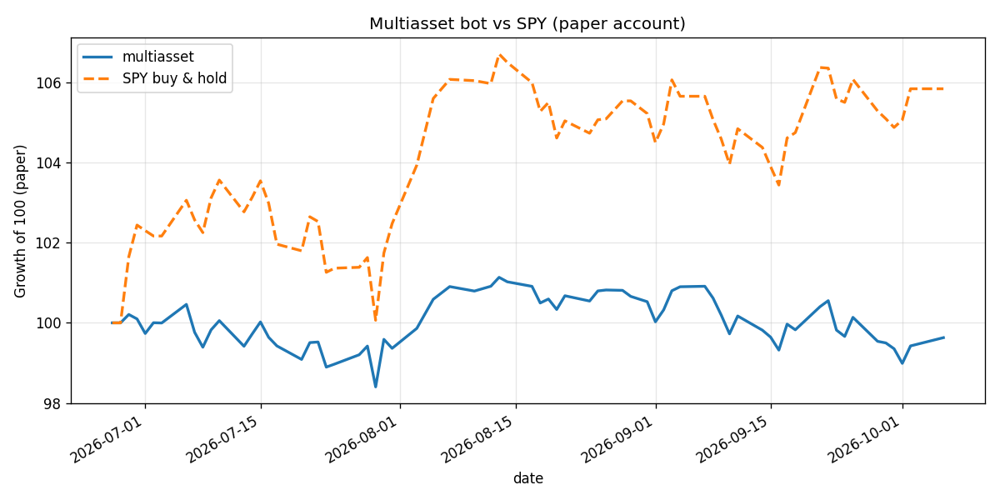

# Multiasset bot vs SPY (paper account)

_Last updated: 2026-10-09 23:26 UTC · live for 104 days · equity $99,591_

| Metric | multiasset | SPY |
|---|---|---|
| Total return | -0.41% | +6.43% |
| Excess vs SPY | -6.84% | — |
| Max drawdown | -2.12% | — |
| Sharpe (since inception) | -0.20 | — |

Reminder: these strategies trail the index for months at a time even when working. Judge on 3-6 months minimum, not weeks.
